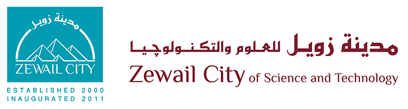

# Anarcho_AV---Multi-agent-RL-for-AV-traffic-clearance

This Repo is still under development. Not Ready for use yet.
Created in partial fullfilment of Graduation Project, Communication and Information Engineering-2020, Zewail City of Science and Technology.    

Under supervision of **Dr. Mohamed El-Shenawy**  
melshenawy@zewailcity.edu.eg    

For more information on the RL-Sumo model, feel free to contact:  
* **Alaa Hesham**: s-alaahesham@zewailcity.edu.eg
* **Waleed Awad**: s-wmustafa@zewailcity.edu.eg
* **Abdulhady Feteiha**: s-abdulhady@zewailcity.edu.eg  

A parallel effort is exerted to construct a ROS (Robot operating system) model along with hardware equipped autonomous vehicles. For more information on that part, please refer to our Robotics heroes:  
* **Tasneem Omara**: s-tsneem.omara@zewailcity.edu.eg
* **Mohamed El-Sayed**: s-mohammedelsayed@zewailcity.edu.eg
* **Nadine Amr**: s-nadine.amr@zewailcity.edu.eg 

# Requirements  
* The sumo version used is a nightly snapshot of past March 19, 2020. Please refer to sumo for Installation and debugging: https://sumo.dlr.de/docs/Downloads.html#nightly_snapshots  
* to install the required libraries:  
  ` pip install -r ./requirements.txt `  
# Train and Save a Q table  
`cd Anarcho1.3`  
`python Anarcho.py --Train`  
# Test a saved Q table  
`cd Anarcho1.3`  
`python Anarcho.py --Test`  

# Versions Contents:
* **Anarcho1.3**: Single RL Agent  + One Ambulance Car 
* **Anarcho1.4**: Mutiple Agents (RL/Auto) + One Ambulance Car, with control over lane busyness, rl_percentage ..etc. Demonstration only, no learning. 
* **Anarcho1.41**: Multiple RL Cars, same as 1.4, but should have independent learners. Still not complete.
* **Anarscho1.5**: Enables running experiments. Introduces the concept of sample(dictionary) and experiment to produce outputs. Still not complete. Cloned from Anarcho1.4.

--------------------------------------------------------------------------  

